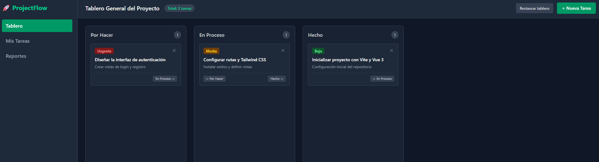

# 📋 ProjectFlow | Aplicación Web de Gestión de Tareas

**ProjectFlow** es una aplicación dinámica de gestión de proyectos, diseñada para organizar flujos de trabajo de manera eficiente.

---

## 🌐 Demo y Despliegue

* **Sitio Web:** **(Aquí puedes poner tu enlace de Netlify cuando lo subas, por ejemplo: `https://tu-proyecto.netlify.app`)*



---

## 🎯 Sobre el Proyecto

Desarrollé este proyecto con el objetivo de crear una herramienta  para la organización de tareas.

---

## ✨ Qué puede hacer la aplicación

* **Tablero:** Organización visual de tareas distribuidas en columnas de *Por Hacer*, *En Proceso* y *Hecho*.
* **Gestión de prioridades:** Clasificación de tareas por niveles de urgencia (*Urgente*, *Media*, *Baja*) con etiquetas de colores distintivos.
* **Modal de creación:** Formulario integrado para añadir nuevas tareas personalizadas al tablero.
* **Vistas dinámicas:** Navegación fluida entre el Tablero General, Mis Tareas y el módulo de Reportes/Métricas del proyecto.
* **Restauración de datos:** Botón de restablecimiento rápido para volver al estado inicial de ejemplo.

---

## 🛠️ Tecnologías Utilizadas

* **Frontend:** Vue 3 (Composition API con `<script setup>`) + TypeScript
* **Empaquetador:** Vite
* **Estilos:** Tailwind CSS
* **Gestión de Estado:** Pinia (Store de Vue)
* **Hosting y Despliegue:** Netlify
* **Control de Versiones:** Git & GitHub

---

## 💻 Instalación y Uso Local

Si quieres clonar y probar el proyecto en tu máquina local, sigue estos pasos:

1. **Clona el repositorio:**
   ```bash
   git clone [https://github.com/tu-usuario/project-flow.git](https://github.com/tu-usuario/project-flow.git)
   cd project-flow
